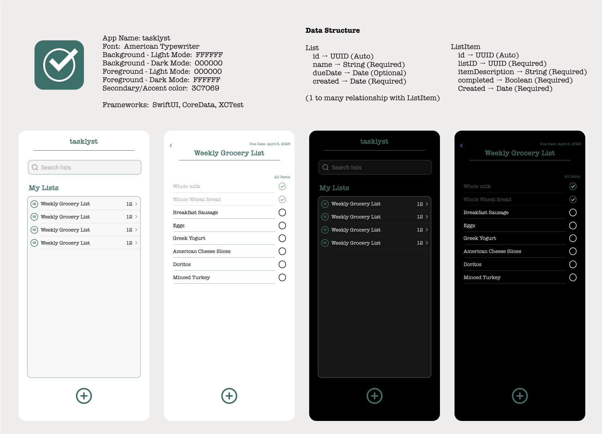

# ✅ tasklyst

> **A clean, minimalist list management iOS app built with SwiftUI + CoreData.**  
> *First of 10 mini-apps in a rapid prototyping challenge to build portfolio-ready projects in 10 weeks.*

---

### 📲 Overview

**tasklyst** is a simple and focused list management app that allows users to:

- Create named lists (like "Weekly Grocery List")
- Simple search for quickly finding lists
- Add checklist-style items with completion tracking
- Completion status sorting
- Organize tasks by due dates (optional)
- Swipe-to-delete interactions
- View list contents in both Light and Dark Mode

This app was designed, built, and tested within **one week** as part of a personal challenge to rapidly improve and expand my iOS development portfolio.

---

### 🛠 Technologies

- **SwiftUI** for the interface  
- **CoreData** for local persistence (first time using it!)  
- **XCTest** for unit testing  
- **Figma** for design and prototyping  

---

### 📐 Design

The UI design is minimal, typography-led, and dark-mode friendly.  
I used [Figma](https://figma.com) to prototype the entire experience:



- Font: **American Typewriter**  
- Accent Color: `#3C7069`  
- Fully styled for both **light and dark modes**

---

### 🧪 Testing

Basic **unit tests** were written for:
- Creating & deleting `ListEntity`
- Creating & deleting `ListItemEntity`
- Updating both entities

These tests verify that **CoreData CRUD operations** behave as expected.

---

### 🚧 Future Enhancements

While I ran out of time on this sprint, I have several ideas for future improvements:

- ✅ TextField validation (empty list names, duplicates, etc.)  
- ✅ Push notifications for upcoming list due dates  
- ✅ List sharing with iCloud or local peer-to-peer sync  
- ✅ Drag-and-drop reordering of items  
- ✅ Swipe-to-complete interactions  
- ✅ Custom sort/filter options  

---

### 📦 Getting Started

To run locally:

```bash
git clone https://github.com/vincemuller/tasklyst.git
open tasklyst.xcodeproj
